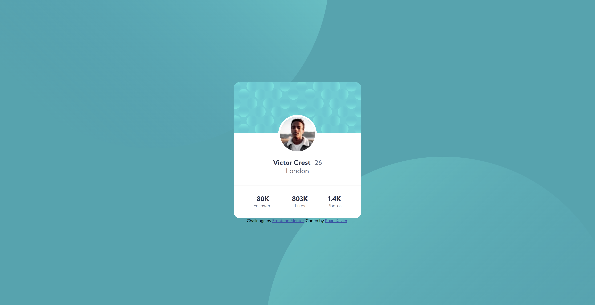
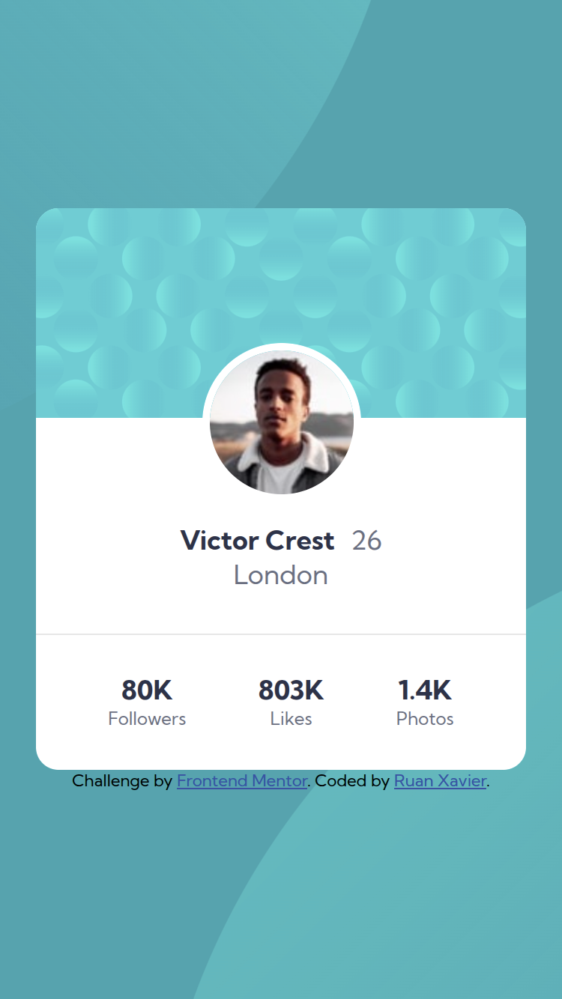

# Frontend Mentor - Profile Card Component

Esta é uma solução para o [desafio do componente de Cartão de Perfil no Frontend Mentor](https://www.frontendmentor.io/challenges/profile-card-component-cfArpWshJ).

## Visão geral

### O desafio

O objetivo é criar um componente de cartão de perfil responsivo, com um design moderno e bem estruturado. O cartão deve conter:
- Uma imagem de fundo no cabeçalho;
- Uma foto de perfil centralizada;
- Nome, idade e localização do usuário;
- Estatísticas de seguidores, curtidas e fotos.

### Captura de tela

### Links

- URL da solução: [https://github.com/ruan-xavier/profile-card-component](https://github.com/ruan-xavier/profile-card-component)
- URL do site ao vivo: [https://cartao-de-usuario.netlify.app/](https://cartao-de-usuario.netlify.app/)

## Meu processo

### Construído com

- HTML5
- CSS (Flexbox)
- Google Fonts

### O que aprendi

Neste projeto, aprendi a:
- Criar um layout centralizado usando `flexbox`;
- Aplicar imagens de fundo de forma responsiva;
- Melhorar a semântica do HTML para acessibilidade;
- Trabalhar com espaçamento e alinhamento para um design mais limpo.

## Autor

- Frontend Mentor - [@ruan-xavier](https://www.frontendmentor.io/profile/ruan-xavier)
- GitHub - [ruan-xavier](https://github.com/ruan-xavier)
- YouTube - [@RuanHenriqueXavier](https://www.youtube.com/@RuanHenriqueXavier)
